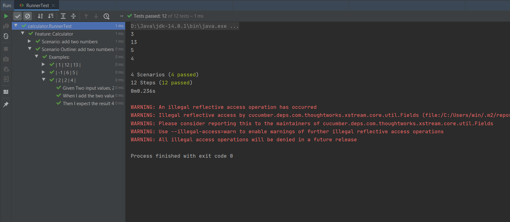
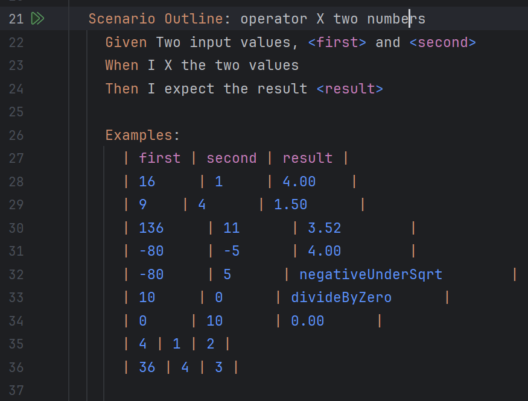
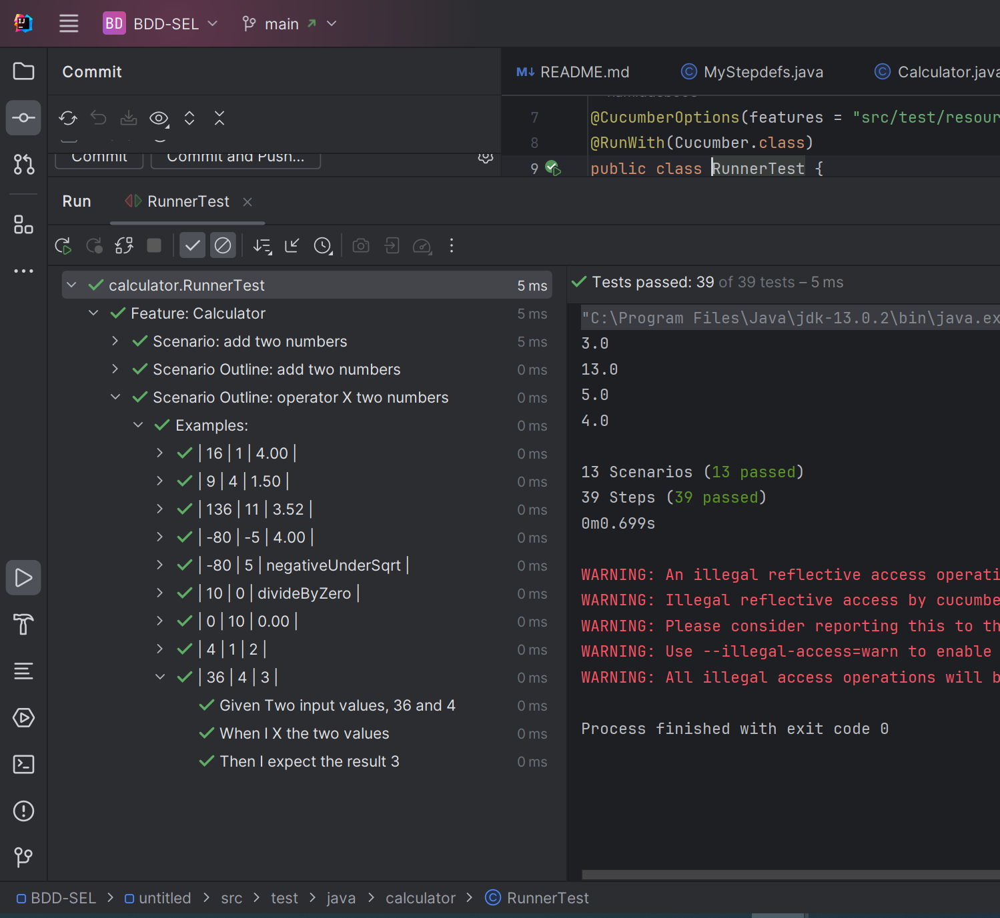

# گزارش آزمایش چهارم

محمد نامدار  ـــــ  حمیدرضا دهباشی

آدرس مخزن پروژه: https://github.com/MoNam97/BDD-SEL

## پاسخ سوال بخش 2
علت خطا به وجود آمده این است که در regex
ارائه شده در دستورکار، کاراکتر منفی '-'
در نظر گرفته نشده و در مواجهه با تست هایی که شامل اعداد منفی اند پیغام خطا می دهد. برای رفع موضوع نیز کافی است عبارت regex 
ورودی تابع را به صورت زیر اصلاح کنیم تا اعداد منفی را نیز شامل شود:

` @Given("^Two input values, (-?\\d+) and (-?\\d+)$")`

همچنین برای اینکه در بررسی جواب تست، گام Then
، مقدار منفی را نیز در نظر بگیرد، کافی است عبارت را اینگونه اصلاح کنیم:

`@Then("^I expect the result (-?\\d+\\.\\d+)$")`

سپس میبینیم که همه تست ها بدون کشکل اجرا می شوند.

## نکات مربوط به پیاده سازی بخش 3

در این بخش تست های مختلفی نوشته شدند که حتی حالت های ایجاد خطا برای رابطه 
$\quad \sqrt{\frac{a}{b}} $
دارند، یعنی مخرج صفر و مقدار منفی زیر رادیکال، نیز شامل می شوند.

و در اینجا نیز همه تست ها پاس می شوند.

